# Linear updates: new configurable payout screens

Live prototype: https://cruz-new.vercel.app

One entry per story that has a screen in the prototype. Each entry has the issue name, a short description, the screenshots, and how it works with a live link. Screenshots are the PNG files in `html/screenshots/` (paths below are relative to this file). Upload them to Linear when you paste an entry.

Stories with no screen yet are listed at the end. For a single file that shows the images (for sharing), use `html/linear-updates.html`.

**Before you paste:** issue names and short descriptions are copied from the story files, so they still say *Manual Bank Transfer* and *payout destination*. The screens say *Payment File for Your Bank* and *Payment Method Details*. Pick one set of names, then update the stories (and these entries) to match.

**Live links for the Collector:** Payment Method Details opens from the flow. Choose a method under How the Rest Is Paid on Payment Breakdown first, then continue. The review pages have a *Prototype only* row at the top to switch between payouts. Venue settings are kept for the current browser tab only.

**Wording to confirm with Brien or Minosha before sharing:** *Payment File for Your Bank*, *Funds Transfer*, *How the Rest Is Paid*, *Payment Method Details*, *Account Name Check*, *Return for Correction*.

---

## Manual Bank Transfer (CRP-250)

### MBT-01 Open the shared venue settings screen as an Admin

**Status:** Built

**Short description:** As an Admin, I want to open payout destination settings for a venue I manage, so that I can configure its Manual Bank process and use the same screen as other destinations are delivered.

**Screenshots:**

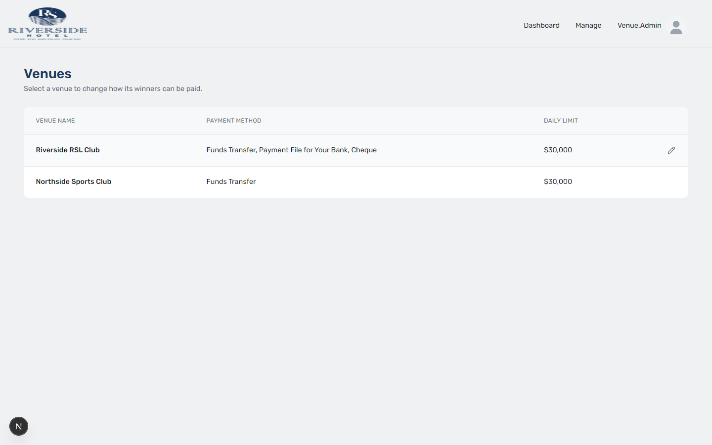

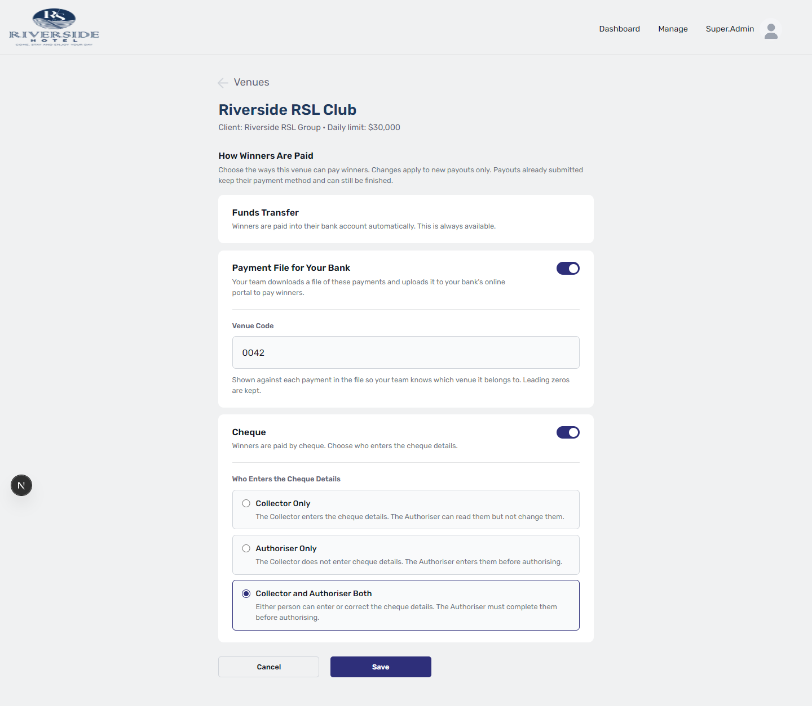

**How it works:** Open Manage, then Venues. Pick a venue from your client's list. The venue screen opens with its name at the top and its saved payment settings. An Admin only sees their own client's venues.

**Live link:**

- [Venues list as an Admin (edit icon shows on hover)](https://cruz-new.vercel.app/admin/venues)
- [Venue Settings: Funds Transfer, Payment File for Your Bank with Venue Code, and Cheque with who enters the details](https://cruz-new.vercel.app/admin/venues/riverside-rsl-club?role=super-admin)

### MBT-02 Open the shared venue screen from Super Admin All Venues

**Status:** Built

**Short description:** As a Super Admin, I want to select a venue from All Venues and configure its basic payout settings, so that I can manage venue setup across clients.

**Screenshots:**

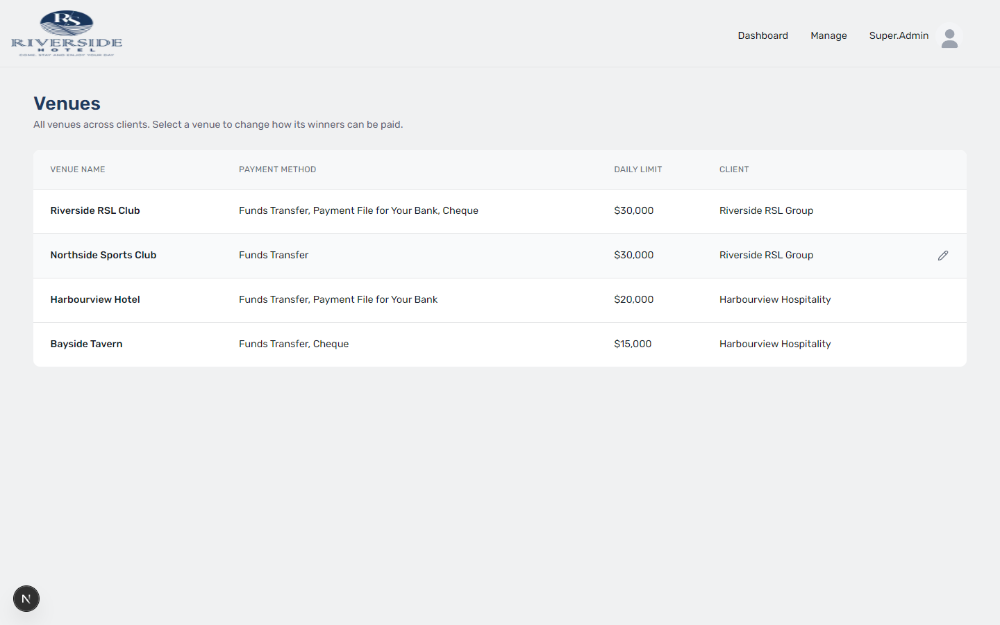

**How it works:** Open Manage, then Venues as a Super Admin (add ?role=super-admin to the link). Every client's venues are listed with a Client column. Select a venue to open its settings. The client and venue name show at the top.

**Live link:**

- [Venues list as a Super Admin, with the Client column](https://cruz-new.vercel.app/admin/venues?role=super-admin)
- [Venue Settings: Funds Transfer, Payment File for Your Bank with Venue Code, and Cheque with who enters the details](https://cruz-new.vercel.app/admin/venues/riverside-rsl-club?role=super-admin)

### MBT-03 Enable Manual Bank Transfer for a venue

**Status:** Built

**Short description:** As an Admin or Super Admin, I want to enable Manual Bank Transfer for a venue, so that staff can prepare venue-managed payments.

**Screenshots:**

**How it works:** On the venue screen, turn on Payment File for Your Bank. A Venue Code field appears under it. The help text explains that your team downloads a file and uploads it to the bank's online portal. It is off until you turn it on.

**Live link:**

- [Venue Settings: Funds Transfer, Payment File for Your Bank with Venue Code, and Cheque with who enters the details](https://cruz-new.vercel.app/admin/venues/riverside-rsl-club?role=super-admin)

### MBT-04 Set the venue code used in Manual Bank exports

**Status:** Built

**Short description:** As an Admin or Super Admin, I want to save the venue code, so that the payment team can identify the venue in exported rows.

**Screenshots:**

**How it works:** With Payment File for Your Bank on, type the Venue Code. The help text explains it appears against each payment in the file. Leading zeros are kept (for example 0042).

**Live link:**

- [Venue Settings: Funds Transfer, Payment File for Your Bank with Venue Code, and Cheque with who enters the details](https://cruz-new.vercel.app/admin/venues/riverside-rsl-club?role=super-admin)

### MBT-05 Save venue settings using shared save behaviour

**Status:** Built

**Short description:** As an Admin or Super Admin, I want to review and save my venue configuration changes, so that the settings take effect deliberately.

**Screenshots:**

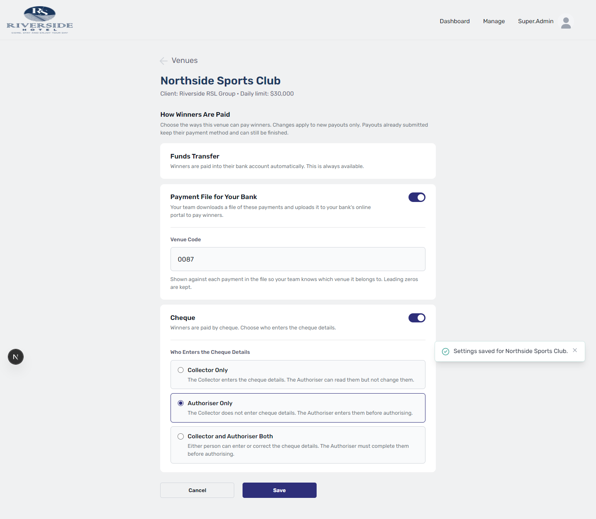

**How it works:** Change any setting and select Save. A confirmation message appears. Reload the page and the saved values are still there. Only this venue changes.

**Live link:**

- [Settings saved: confirmation message shown](https://cruz-new.vercel.app/admin/venues/northside-sports-club?role=super-admin)

### MBT-06 Cancel venue edits using shared cancellation behaviour

**Status:** Built

**Short description:** As an Admin or Super Admin, I want to cancel unsaved venue configuration changes, so that I can discard edits without changing the venue.

_Note: Cancel sits beside Save and puts back the saved values._

**Screenshots:**

**How it works:** Change a setting, then select Cancel. The screen goes back to the last saved values.

**Live link:**

- [Venue Settings: Funds Transfer, Payment File for Your Bank with Venue Code, and Cheque with who enters the details](https://cruz-new.vercel.app/admin/venues/riverside-rsl-club?role=super-admin)

### MBT-07 Disable Manual Bank Transfer for new submissions

**Status:** Built

**Short description:** As an Admin or Super Admin, I want to disable Manual Bank Transfer for a venue, so that new submissions stop using this venue-managed payment method.

_Note: Turning the switch off removes the option for new payouts._

**Screenshots:**

**How it works:** Turn Payment File for Your Bank off and Save. It stops being offered to Collectors for new payouts. Payouts already submitted keep their payment method.

**Live link:**

- [Venue Settings: Funds Transfer, Payment File for Your Bank with Venue Code, and Cheque with who enters the details](https://cruz-new.vercel.app/admin/venues/riverside-rsl-club?role=super-admin)

### MBT-08 Record and preserve the submitted bank destination

**Status:** Built

**Short description:** As an Admin or Super Admin, I want submitted bank payouts to keep their recorded destination, so that later venue configuration changes cannot reroute them.

_Note: The review shows the method recorded when the payout was submitted._

**Screenshots:**

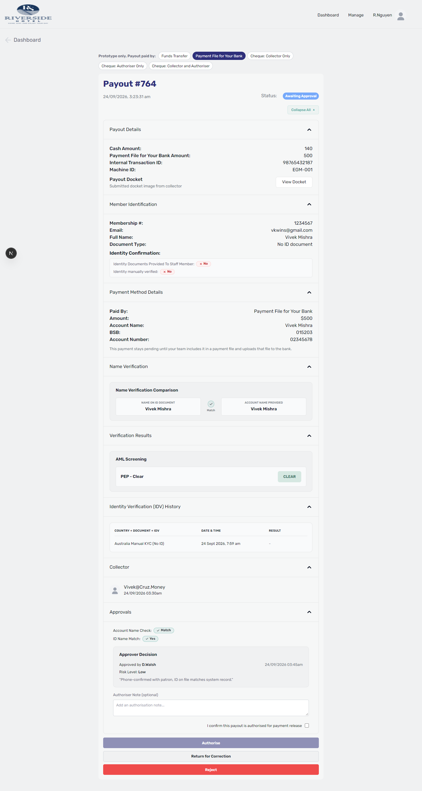

**How it works:** Open any payout from the Approver or Authoriser. Payment Method Details shows how the payout was set up to be paid when it was submitted. A payment file payout also says it stays pending until the file is uploaded to the bank.

**Live link:**

- [Authoriser review: Payment File for Your Bank payout](https://cruz-new.vercel.app/authoriser/payout?scenario=payment-file)

### MBT-09 Continue with a cash-only payout

**Status:** Built

**Short description:** As a Collector, I want to proceed without non-cash destination fields when the payout is entirely cash, so that irrelevant fields do not block collection.

**Screenshots:**

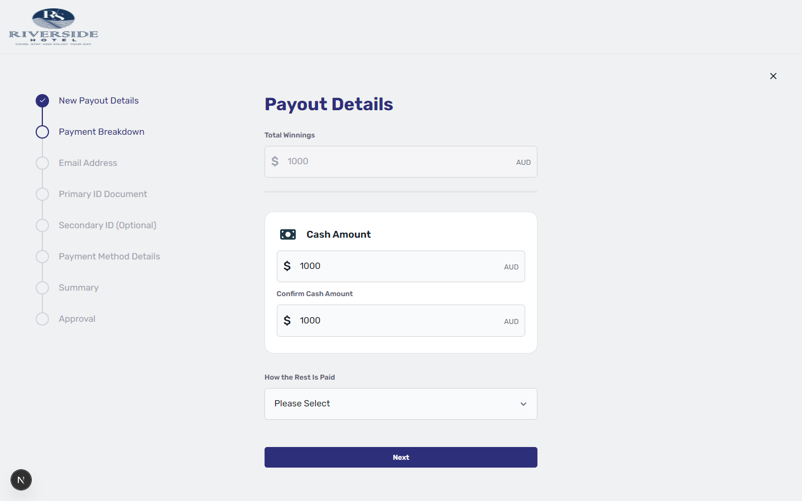

**How it works:** On Payment Breakdown, enter the full amount as cash and leave How the Rest Is Paid empty. Next goes straight on, with no payment method details to fill in.

**Live link:**

- [Collector: cash-only payout, nothing chosen under How the Rest Is Paid](https://cruz-new.vercel.app/collector/payment-breakdown)

### MBT-10 Save and reopen bank details through the shared draft flow

**Status:** Partly built

**Short description:** As a Collector, I want to save and reopen bank payout details, so that I can continue capture without entering the same information again.

_Note: Shows the message when a saved method is no longer available. Saving and reopening drafts is not modelled in the prototype._

**Screenshots:**

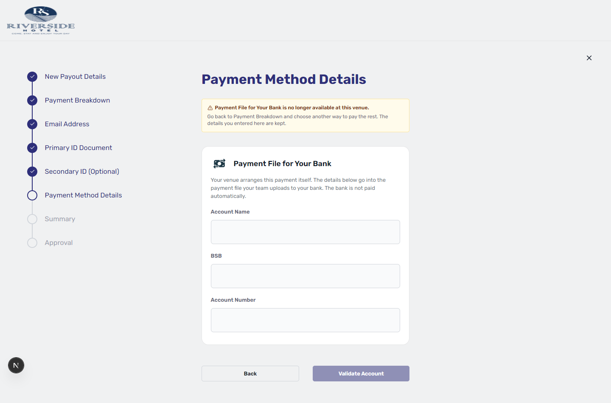

**How it works:** Choose a payment method, then have the venue switch it off. When the Collector reaches Payment Method Details, a message says the method is no longer available and asks them to choose another. What they typed is kept.

**Live link:**

- [Collector: the chosen method has since been switched off at the venue](https://cruz-new.vercel.app/collector/payment-breakdown)

### MBT-11 Capture Manual Bank account details

**Status:** Built

**Short description:** As a Collector, I want to enter the recipient’s Manual Bank details, so that the venue can arrange the transfer.

**Screenshots:**

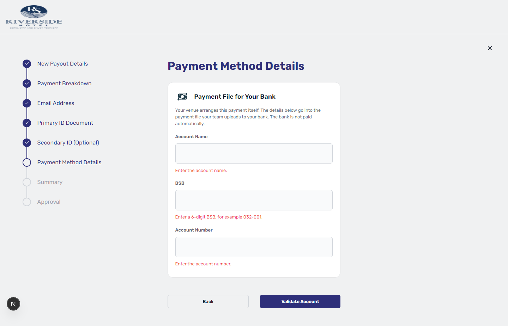

**How it works:** Choose Payment File for Your Bank on Payment Breakdown, then continue to Payment Method Details. Enter Account Name, BSB and Account Number. Select Validate Account with fields empty or wrong to see the messages.

**Live link:**

- [Collector: Payment File for Your Bank details with messages for missing or invalid fields](https://cruz-new.vercel.app/collector/payment-breakdown)

### MBT-12 Review or return Manual Bank details

**Status:** Built

**Short description:** As an Approver or Authoriser, I want to review the Manual Bank destination and account details, so that I can assess the payout before approving or authorising.

**Screenshots:**

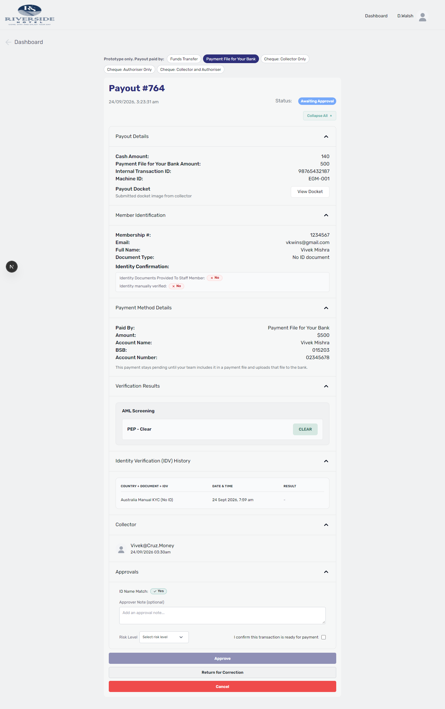

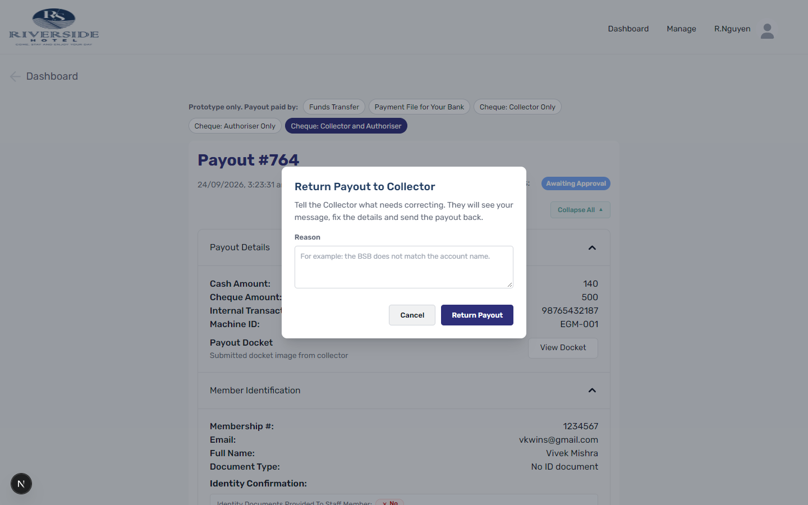

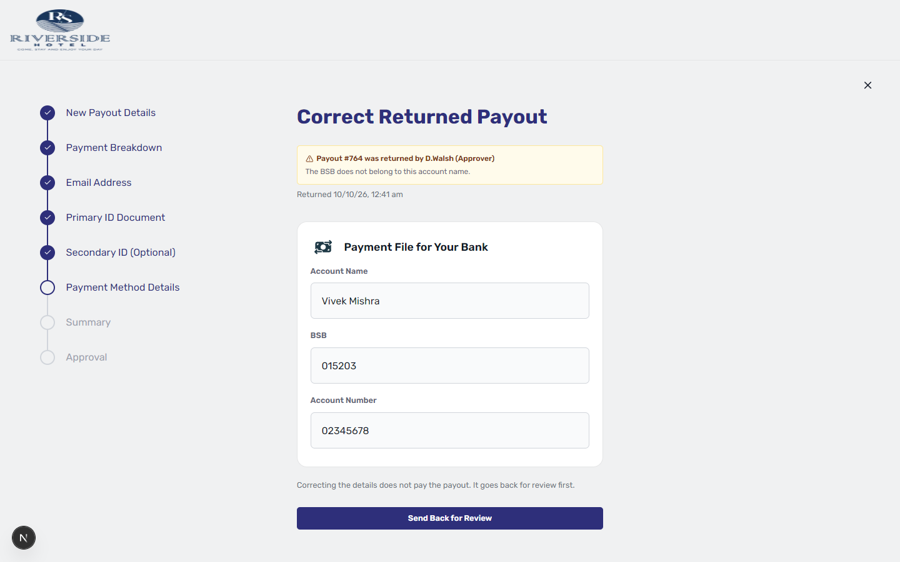

**How it works:** Open the Approver or Authoriser review for a payment file payout. The account details and amount are shown. Select Return for Correction, enter a reason, and you are taken to the Collector's correction page showing that reason.

**Live link:**

- [Authoriser review: Payment File for Your Bank payout](https://cruz-new.vercel.app/authoriser/payout?scenario=payment-file)
- [Approver review: Payment File for Your Bank payout](https://cruz-new.vercel.app/approver/payout?scenario=payment-file)
- [Return for Correction asks for a reason](https://cruz-new.vercel.app/authoriser/payout?scenario=cheque-both)
- [Collector: a returned Payment File for Your Bank payout with the reviewer's reason](https://cruz-new.vercel.app/collector/returned-payout?type=payment-file)

---

## Cheque (CRP-321)

### CHE-01 Enable Cheque and add its controls to the shared venue screens

**Status:** Built

**Short description:** As an Admin or Super Admin, I want to enable Cheque for a venue, so that Collectors can offer this approved destination.

**Screenshots:**

**How it works:** On the venue screen, turn Cheque on. Who enters the cheque details appears under it. The same Save and Cancel apply as for the other payment methods.

**Live link:**

- [Venues list as a Super Admin, with the Client column](https://cruz-new.vercel.app/admin/venues?role=super-admin)
- [Venue Settings: Funds Transfer, Payment File for Your Bank with Venue Code, and Cheque with who enters the details](https://cruz-new.vercel.app/admin/venues/riverside-rsl-club?role=super-admin)

### CHE-02 Choose cheque collection responsibility

**Status:** Built

**Short description:** As an Admin or Super Admin, I want to choose who enters cheque details, so that the venue follows its operational process.

_Note: This is CRP-326._

**Screenshots:**

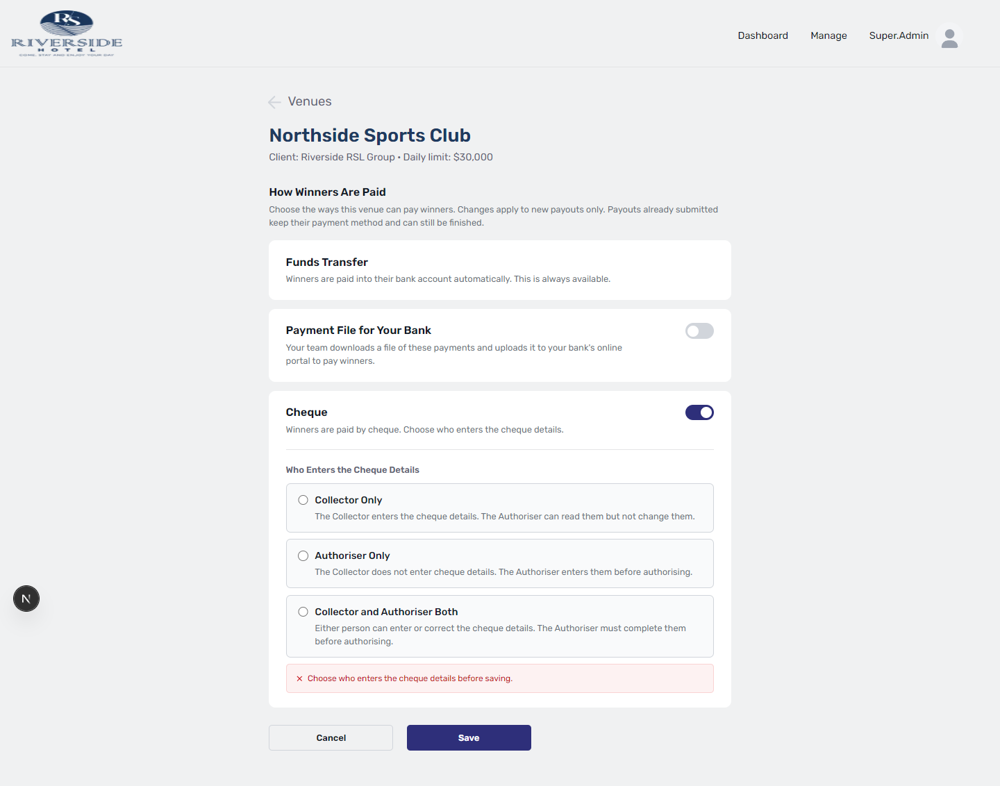

**How it works:** With Cheque on, choose one of three options: Collector Only, Authoriser Only, or Collector and Authoriser Both. Each has a short explanation. Saving with Cheque on and no option chosen shows a message and does not save.

**Live link:**

- [Venue Settings: Funds Transfer, Payment File for Your Bank with Venue Code, and Cheque with who enters the details](https://cruz-new.vercel.app/admin/venues/riverside-rsl-club?role=super-admin)
- [Saving with Cheque on and no choice of who enters the details shows a message](https://cruz-new.vercel.app/admin/venues/northside-sports-club?role=super-admin)

### CHE-03 Disable Cheque for new submissions

**Status:** Built

**Short description:** As an Admin or Super Admin, I want to disable Cheque for a venue, so that staff stop offering it for new submissions.

**Screenshots:**

**How it works:** Turn Cheque off and Save. Cheque stops being offered for new payouts at that venue. Cheque payouts already submitted keep their details and can still be finished.

**Live link:**

- [Venue Settings: Funds Transfer, Payment File for Your Bank with Venue Code, and Cheque with who enters the details](https://cruz-new.vercel.app/admin/venues/riverside-rsl-club?role=super-admin)

### CHE-04 Preserve the submitted cheque destination and capture mode

**Status:** Built

**Short description:** As an Admin or Super Admin, I want submitted cheque payouts to keep their method and capture responsibility, so that venue changes do not alter the workflow midway through review.

_Note: Each review shows who enters the cheque details, as recorded at submission._

**Screenshots:**

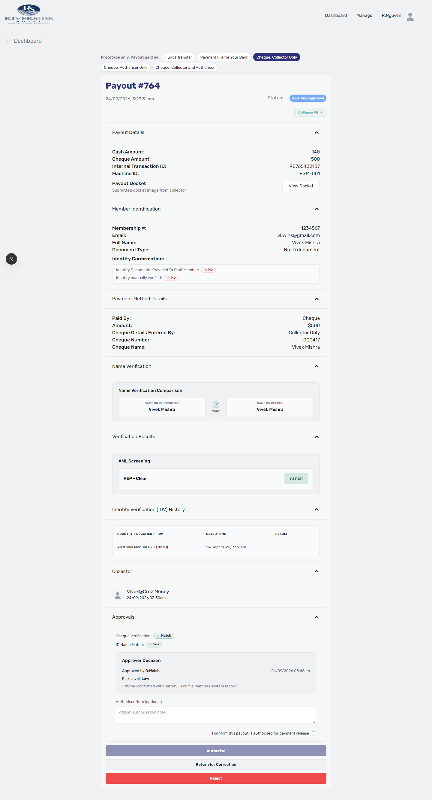

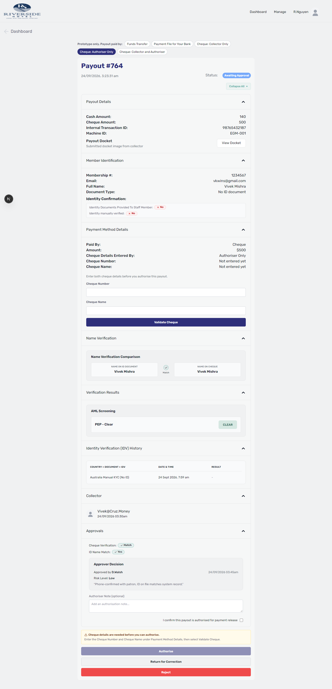

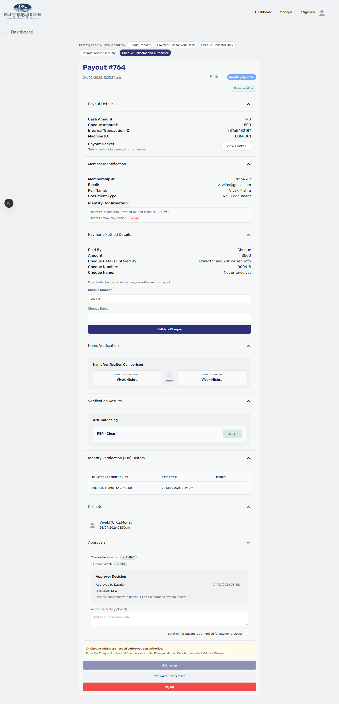

**How it works:** Open a cheque payout in the Approver or Authoriser review. Payment Method Details shows who enters the cheque details, as chosen when the payout was submitted.

**Live link:**

- [Authoriser review: cheque details entered by the Collector, read-only](https://cruz-new.vercel.app/authoriser/payout?scenario=cheque-collector)
- [Authoriser review: the Authoriser enters the cheque details; Authorise stays off until done](https://cruz-new.vercel.app/authoriser/payout?scenario=cheque-authoriser)
- [Authoriser review: Collector entered the number; the Authoriser completes the name](https://cruz-new.vercel.app/authoriser/payout?scenario=cheque-both)

### CHE-06 Choose an enabled non-cash destination

**Status:** Built

**Short description:** As a Collector, I want to select one available non-cash destination, so that the payout uses the approved payment method.

_Note: Only the methods switched on for the venue are offered._

**Screenshots:**

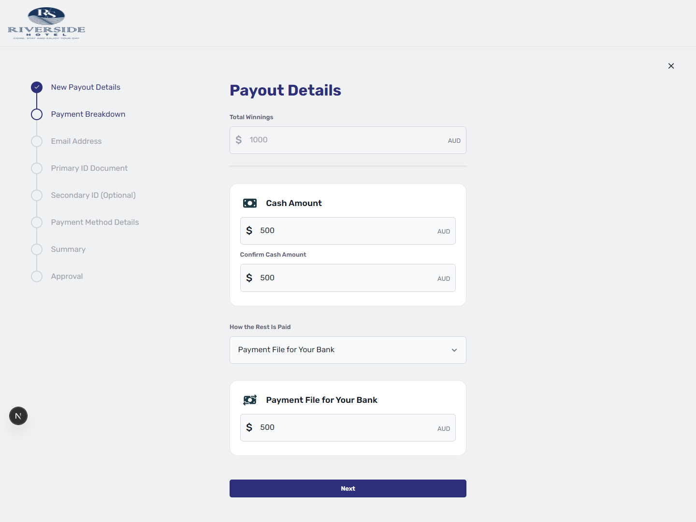

**How it works:** On Payment Breakdown, open How the Rest Is Paid. Only the methods the venue has switched on are listed. Choosing one shows an amount box for it.

**Live link:**

- [Collector: Payment Breakdown with the venue's available ways to pay the rest](https://cruz-new.vercel.app/collector/payment-breakdown)

### CHE-07 Save and reopen cheque destination details in a draft

**Status:** Partly built

**Short description:** As a Collector, I want to save and reopen my cheque destination details, so that I can continue from the values already captured.

_Note: Optional fields and the unavailable-method message are shown. Saving and reopening drafts is not modelled._

**Screenshots:**

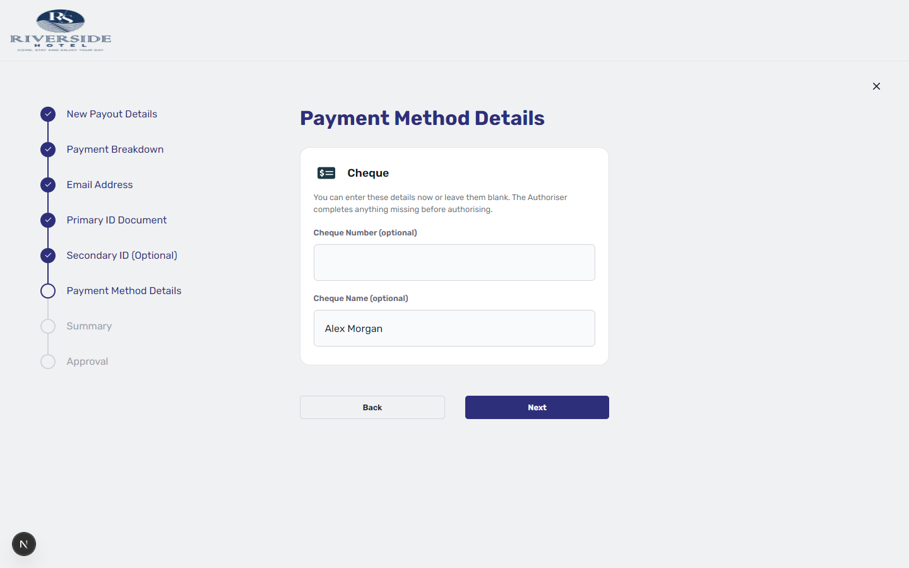

**How it works:** Choose Cheque with Collector and Authoriser Both: the cheque fields are optional. If the venue has since switched a method off, the Collector sees a message and is asked to choose another.

**Live link:**

- [Collector: the chosen method has since been switched off at the venue](https://cruz-new.vercel.app/collector/payment-breakdown)
- [Collector: Cheque when both enter the details (fields optional)](https://cruz-new.vercel.app/collector/payment-breakdown)

### CHE-08 Enter collector-only cheque details

**Status:** Built

**Short description:** As a Collector, I want to enter complete cheque details in Collector only mode, so that the Authoriser receives a complete record.

**Screenshots:**

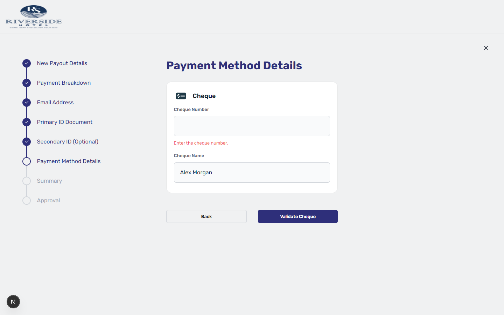

**How it works:** With Collector Only, Payment Method Details shows Cheque Number and Cheque Name, both required. The name starts as the winner's name. Select Validate Cheque with a field empty to see the message.

**Live link:**

- [Collector: Cheque details when the Collector enters them (both required)](https://cruz-new.vercel.app/collector/payment-breakdown)

### CHE-09 Review collector-only cheque details without editing

**Status:** Built

**Short description:** As an Authoriser, I want to review collector-entered cheque details without editing them, so that capture responsibility remains with the Collector.

**Screenshots:**

**How it works:** Open the Authoriser review for a Collector Only cheque. The cheque details are shown but cannot be changed. Return for Correction sends it back with a reason.

**Live link:**

- [Authoriser review: cheque details entered by the Collector, read-only](https://cruz-new.vercel.app/authoriser/payout?scenario=cheque-collector)
- [Return for Correction asks for a reason](https://cruz-new.vercel.app/authoriser/payout?scenario=cheque-both)

### CHE-10 Correct returned collector-only cheque details

**Status:** Built

**Short description:** As a Collector, I want to correct cheque details returned by the Authoriser, so that the payout can be reviewed again.

**Screenshots:**

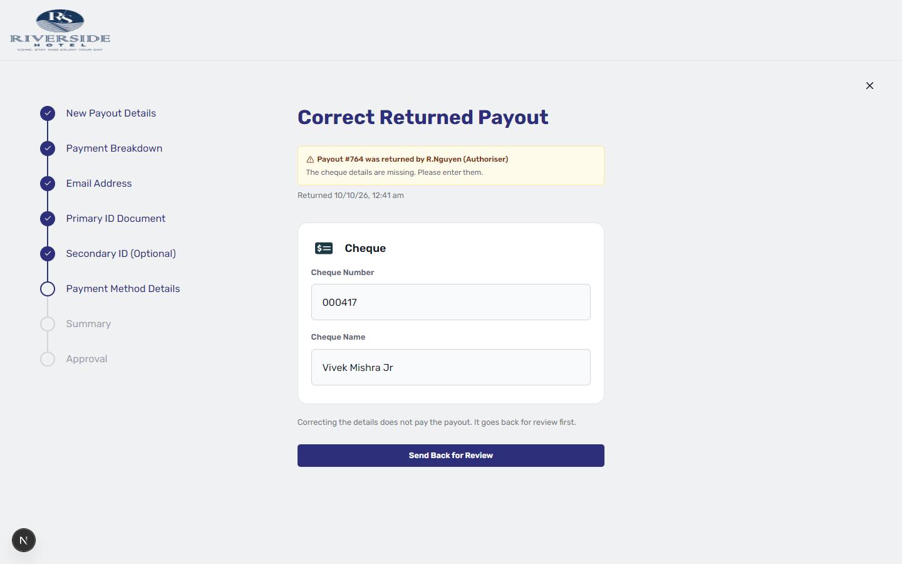

**How it works:** After a cheque is returned, the Collector opens the correction page. It shows who returned it and why, with the saved cheque details ready to edit. Send Back for Review checks both fields first.

**Live link:**

- [Collector: a returned cheque payout with the reviewer's reason](https://cruz-new.vercel.app/collector/returned-payout?type=cheque)

### CHE-11 Submit an authoriser-only cheque payout

**Status:** Built

**Short description:** As a Collector, I want to submit a cheque payout without entering cheque details in Authoriser only mode, so that the Authoriser can prepare the cheque at review.

**Screenshots:**

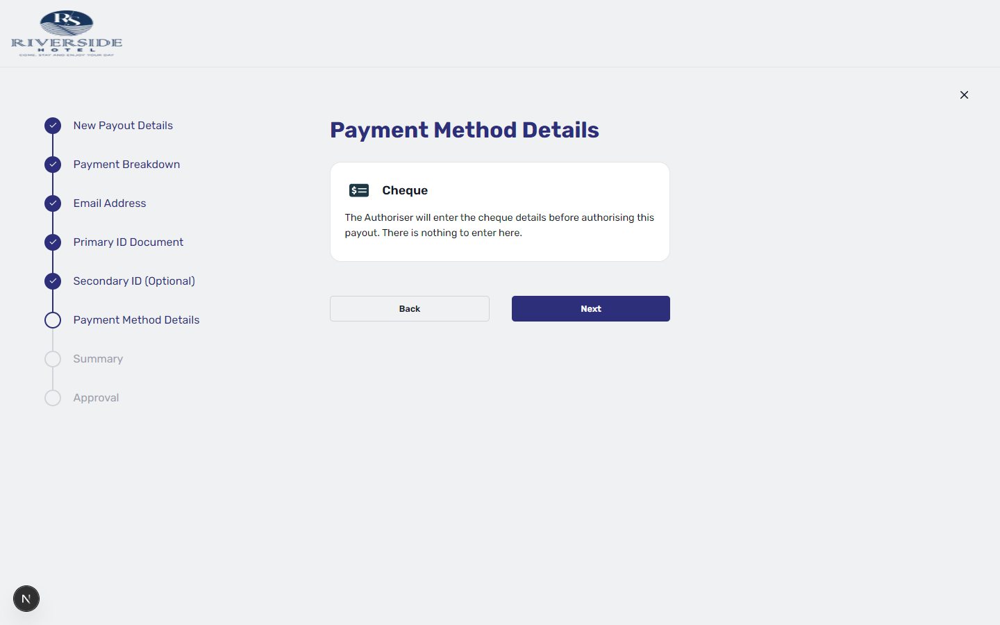

**How it works:** With Authoriser Only, the Collector sees that there is nothing to enter and continues. In the Authoriser review, the Authoriser enters Cheque Number and Cheque Name. Authorise stays off until both are entered and checked.

**Live link:**

- [Collector: Cheque when the Authoriser enters the details (nothing to enter)](https://cruz-new.vercel.app/collector/payment-breakdown)
- [Authoriser review: the Authoriser enters the cheque details; Authorise stays off until done](https://cruz-new.vercel.app/authoriser/payout?scenario=cheque-authoriser)

### CHE-12 Capture authoriser-only cheque details

**Status:** Built

**Short description:** As an Authoriser, I want to enter cheque name and number during authorisation, so that I can complete the cheque record at the assigned stage.

**Screenshots:**

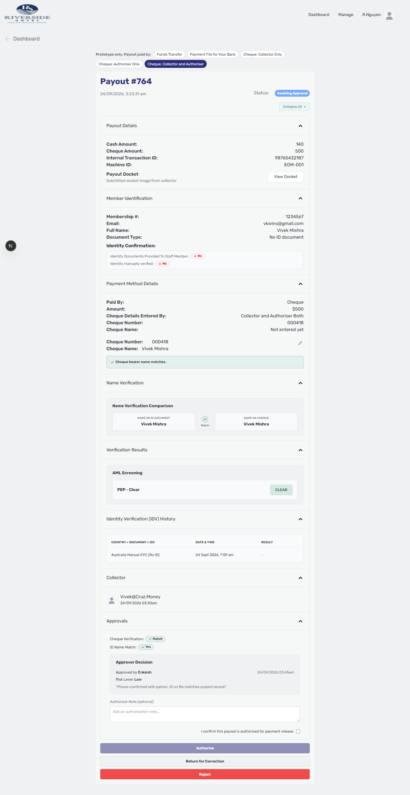

**How it works:** In the Authoriser review, enter Cheque Number and Cheque Name, then select Validate Cheque. The details are shown with a pencil to edit them again. Authorise can be used once the confirm box is ticked.

**Live link:**

- [Authoriser review: the Authoriser enters the cheque details; Authorise stays off until done](https://cruz-new.vercel.app/authoriser/payout?scenario=cheque-authoriser)
- [Authoriser review: cheque details completed and checked](https://cruz-new.vercel.app/authoriser/payout?scenario=cheque-both)

### CHE-13 Collect cheque details in both-role mode

**Status:** Built

**Short description:** As a Collector, I want to enter the cheque details available at collection in both-role mode, so that the Authoriser can continue from my saved values.

**Screenshots:**

**How it works:** With Collector and Authoriser Both, the Collector can fill in both cheque details, one of them, or neither, and still continue. Anything left blank shows as Not entered yet on the Summary.

**Live link:**

- [Collector: Cheque when both enter the details (fields optional)](https://cruz-new.vercel.app/collector/payment-breakdown)

### CHE-14 Complete or correct both-role cheque details

**Status:** Built

**Short description:** As an Authoriser, I want to complete or correct the Collector’s saved cheque details, so that one accurate record is ready for authorisation.

**Screenshots:**

**How it works:** In the Authoriser review, anything the Collector left blank can be completed. In the example, the Collector entered the number and the Authoriser adds the name. Both are needed before Authorise is available.

**Live link:**

- [Authoriser review: Collector entered the number; the Authoriser completes the name](https://cruz-new.vercel.app/authoriser/payout?scenario=cheque-both)
- [Authoriser review: cheque details completed and checked](https://cruz-new.vercel.app/authoriser/payout?scenario=cheque-both)

### CHE-15 Default cheque name and preserve cheque number

**Status:** Built

**Short description:** As a Collector or Authoriser with capture rights, I want to use a sensible default name and record the printed cheque number accurately, so that the saved fields describe the intended payee and cheque.

_Note: The cheque name starts as the winner's name._

**Screenshots:**

**How it works:** On the Collector's cheque form, the Cheque Name starts as the winner's name and can be changed. The Cheque Number is typed as text, so leading zeros are kept.

**Live link:**

- [Collector: Cheque details when the Collector enters them (both required)](https://cruz-new.vercel.app/collector/payment-breakdown)

### CHE-16 Review the cheque destination summary

**Status:** Built

**Short description:** As a Collector, Approver or Authoriser, I want to see the cheque destination and saved details together, so that I understand the payout before my next action.

_Note: Shown in the Payment Method Details section._

**Screenshots:**

**How it works:** Open any cheque payout in the Approver or Authoriser review. Payment Method Details shows Paid By, Amount, who enters the cheque details, the Cheque Number and the Cheque Name.

**Live link:**

- [Authoriser review: cheque details entered by the Collector, read-only](https://cruz-new.vercel.app/authoriser/payout?scenario=cheque-collector)
- [Authoriser review: the Authoriser enters the cheque details; Authorise stays off until done](https://cruz-new.vercel.app/authoriser/payout?scenario=cheque-authoriser)

---

## Stories with no screen yet

| Story | Status | Note |
|---|---|---|
| MBT-13 See Manual Bank export readiness | Existing page, to be checked against this story |  |
| MBT-14 Exclude Manual Bank from automated payments and spending limits | No screen needed | Backend rule: no screen. |
| MBT-15 Open Manual Bank exports from the authorisation workspace | Existing page, to be checked against this story | The export page is reached from the Authoriser's Manage menu. Not yet checked against this story. |
| MBT-16 Open Manual Bank exports under Manage | Existing page, to be checked against this story | The export page is reached from the Authoriser's Manage menu. Not yet checked against this story. |
| MBT-17 Select exactly one client for a Super Admin export | Screen not built yet |  |
| MBT-18 Select exactly one venue for each export | Screen not built yet |  |
| MBT-19 Filter exports by collection-date range | Existing page, to be checked against this story |  |
| MBT-20 See ready, held, exported and skipped payout records | Existing page, to be checked against this story | The held and skipped records are not shown yet. |
| MBT-21 Confirm a new export before downloading | Existing page, to be checked against this story |  |
| MBT-22 Download accurate CSV values | Existing page, to be checked against this story |  |
| MBT-23 Complete only valid payouts included in the first export | No screen needed | Backend rule: no screen. |
| MBT-24 Understand export success, failure and retry | Screen not built yet |  |
| MBT-25 Download previously exported payouts again | Existing page, to be checked against this story |  |
| MBT-26 Review the fixed CSV columns and preview | Out of scope | CSV customisation is out of scope for now. |
| MBT-27 Rename CSV column labels in Strapi | Out of scope | CSV customisation is out of scope for now. |
| MBT-28 Receive Manual Bank review notifications | No screen needed | Notification: no screen in the prototype. |
| MBT-29 Receive one Manual Bank completion confirmation | No screen needed | Notification: no screen in the prototype. |
| MBT-30 Verify the Manual Bank and configuration workflows | No screen needed | Verification story: no screen. |
| CHE-05 Set the global cheque name-match threshold | Screen not built yet | Super Admin setting. |
| CHE-17 Show cheque and recipient names with their similarity | Screen not built yet | Name match: next to build. |
| CHE-18 Refresh the name check when compared names change | Screen not built yet | Name match: next to build. |
| CHE-19 Use the captured recipient name when no ID document is submitted | Screen not built yet | Name match: next to build. |
| CHE-20 Require an Authoriser rationale for a name mismatch | Screen not built yet | Name match: next to build. |
| CHE-21 Acknowledge the cheque name difference before completion | Screen not built yet | Name match: next to build. |
| CHE-22 Retain and review cheque name-resolution history | Screen not built yet | Name match: next to build. |
| CHE-23 See cheque payment status and outstanding conditions | Screen not built yet |  |
| CHE-24 Automatically complete a cheque payout after all requirements are met | No screen needed | Backend rule: no screen. |
| CHE-25 Keep cheques out of automated execution while counting daily spending | No screen needed | Backend rule: no screen. |
| CHE-26 Receive cheque review notifications | No screen needed | Notification: no screen in the prototype. |
| CHE-27 Receive one cheque completion confirmation | No screen needed | Notification: no screen in the prototype. |
| CHE-28 Verify the cheque workflow and shared-screen integration | No screen needed | Verification story: no screen. |
